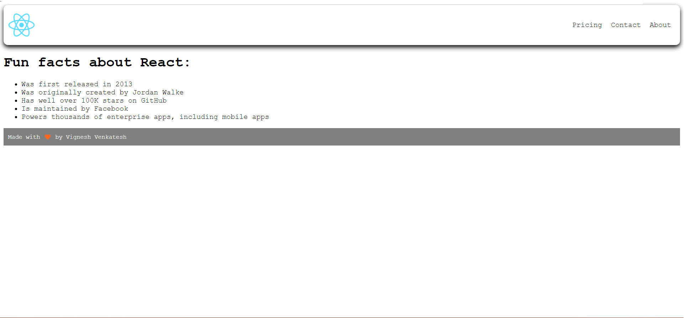

## **DAY 5 (12-MAR-2022)**
---
I know, I know,.. I told yesterday that I would try to solve a few level 2 questions from the A2OJ ladder. But I am totally not in the mood today to solve them and I also think I need to know a bit more on how to approach the problems, so.. I would probably take a look at them again after midterm week 😬..

However, I did begin learning ReactJS and so far it's been super fun and I am just in love with it.. Let's see how this goes.. 🙂

---
**`CDN`** stands for **Content Delivery Network**, which we will be using for now, instead of using npm to install the packages and dependencies

---

**This is written in React:**
```javascript
//Creating your own component
function MainContent() {
    return (
        <h1>I'm learning React</h1>
    )
}

ReactDOM.render(
    <div>
        <MainContent />
    </div>,
    document.getElementById("root")
)
```
**This is the above code but written in Vanilla JS:**
```javascript
// This is the Javascript way to write the above code
const h1 = document.createElement("h1")
h1.textContent = "This is an imperative way to program"
h1.className = "header"
document.getElementById("root").append(h1)
```
---
The approach used in React is a **`Declarative Approach`**. This means something like this: *`"Just tell me what to do, and I'll worry about how I get it done`*

The approach used in Vanilla JS is a **`Imperative Approach`**. This means something like this: *`Describe to me every step on how to do something, and I'll do it`*

---
React uses the **`JSX`** format
```javascript
// JSX Format
const element = <h1 className = "header">This is JSX</h1>
console.log(element)
ReactDOM.render(element, document.getElementById("root"))

//==========================================================

// More Code in the JSX Format
const page = (
    <div>
        <h1 className = "header">This is JSX</h1>
        <p>This is a paragraph</p>
    </div>
)

ReactDOM.render(page, document.getElementById("root"))
```
---
After learning the basics of React and going through the project demo from the youtube video by freecodecamp, I used my minimal CSS skills to make a page of some sorts *(P.S. It ain't good😔)*

**Here is the image:**


Yep, I still dont know how to bring the footer down.. But, I'm pretty sure I'll eventually learn CSS.. so not worried about it now. 🙂

---
Alright then I guess that's it for today.. I'll probably try looking into CSS a bit tomorrow, so let's see how that goes.. Byee 👋

---
